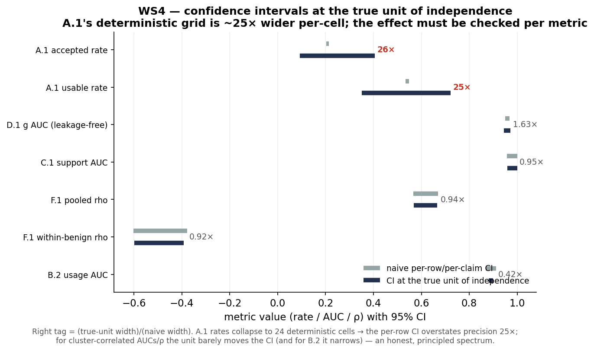
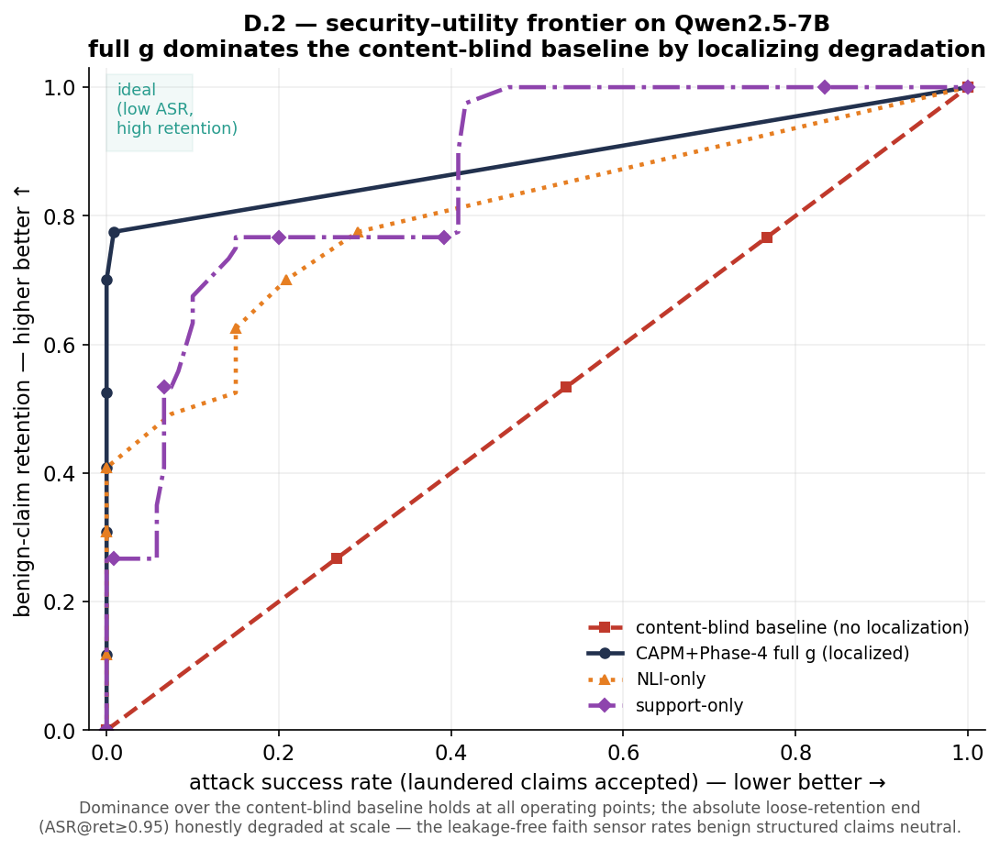
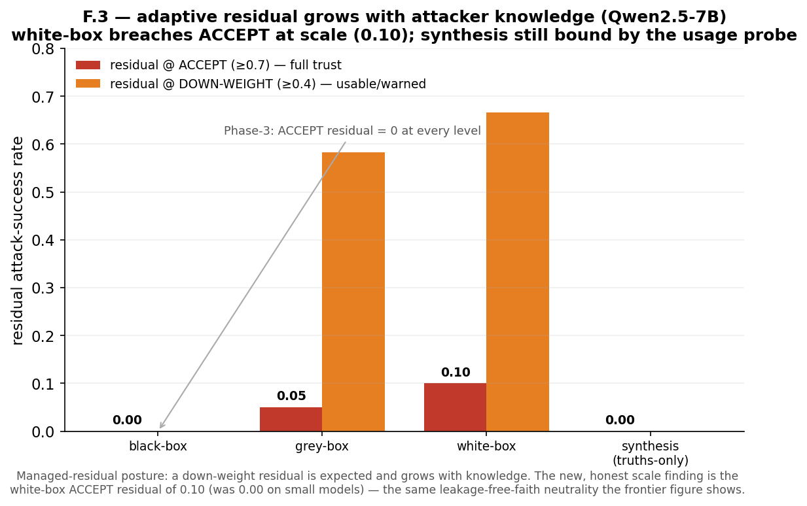
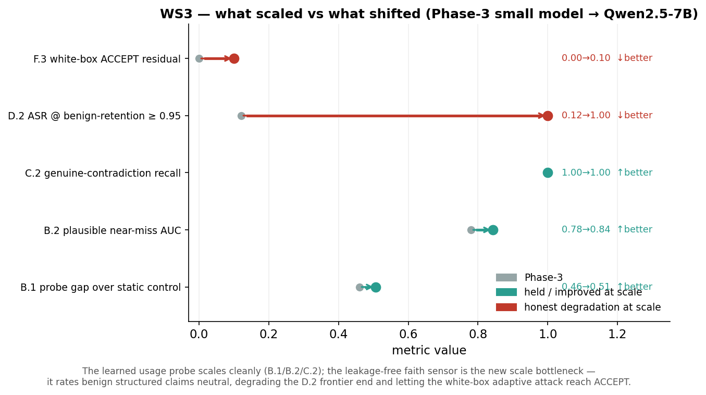

# CAPM Phase 4 — Consolidation & Finalization · Telemetry Ledger (`phase4_results.md`)

**Phase 4 thesis.** Phase 3 established a sound by-construction safety invariant and reproduced the core localization results; independent verification ([PHASE3_VERIFICATION.md](../phase3/PHASE3_VERIFICATION.md)) then surfaced seven secondary measurement/framing defects. **Phase 4 is consolidation, not a new mechanism** — fix the defects, pull every claim back to exactly what the evidence supports, then scale and substantiate. The discipline is **subtraction, not addition**: the result is strongest when every sentence survives a reviewer re-running the code.

**This document** is the executed-experiment ledger for **Workstream 1 — the three non-optional correctness corrections** (the gate before any scale run; per [experiments4.md](experiments4.md) and [CAPM_Phase4_Consolidation (1).md](CAPM_Phase4_Consolidation (1).md)). All three are implemented as **net-new `p4/` code that never edits the Phase-3 `p3/` tree**, and all three PASS.

**Core discipline preserved:** the security guarantee is untouched (`g ≤ 1`, `w = min(w_decl, g·w_decl) ≤ w_decl`); none of these corrections changes a load-bearing PASS verdict — they correct *secondary* calibration/measurement/table claims. No calibration adjective is claimed until the D.1 rerun exists (it now does, and the honest finding is reported below).

---

## Execution environment (reproducibility)

| Item            | Value                                                                                                                                                  |
| --------------- | ------------------------------------------------------------------------------------------------------------------------------------------------------ |
| Host            | `ramanlab` (`ssh rajesh@172.17.254.147`)                                                                                                           |
| Workspace       | `/scratch/panora/CAPM/capm-testbed/` (rsynced Phase-3 tree; fresh venv at `/scratch/panora/CAPM/.venv`)                                            |
| Python / Torch  | Python**3.10.12**, torch **2.6.0+cu124**, transformers 5.12.1, scikit-learn 1.7.2                                                          |
| GPU             | 1×**NVIDIA A10, 23 GB** (WS1 is CPU/deterministic — GPU not used here; reserved for WS3)                                                       |
| NLI model (D.1) | `cross-encoder/nli-deberta-v3-xsmall` (premise = rendered source `ctx`)                                                                            |
| Data            | real cached `p3/results/scored_claims.csv` (1,540 claims) and `p3/results/a1/a1_raw.csv` (23,040 rows)                                             |
| `p4/` code    | `p4/sensors/score.py`, `p4/warrant/realized.py`, `p4/exp/p1a_calibration_fixed.py`, `p4/exp/p1b_locality.py`, `p4/audit/recompute_tables.py` |

---

## Experiment index & status

Legend: ☑ complete · PASS

- ☑ **P4-1A** — D.1 calibration **leakage fix** (HIGH). **→ FIXED.** `faith` regrounded in the source document; no feature is a deterministic function of the label. `u+s` AUC **0.986**; faith marginal lift over `u+s` = **+0.008** → `faith` repositioned as a contradiction-specific safety signal, **not** a calibration contributor. Sanity control reproduces the leaked 0.999→**1.000**.
- ☑ **P4-1B** — D.3 **locality** test (MEDIUM). **→ FIXED.** Structural invariant proven (no cross-claim term) **and** a genuine corruption-free recomputation shows **0 contamination**, with a negative control **detecting 700/700** when an artificial cross-claim term is injected (the self-copy tautology is gone).
- ☑ **P4-1C** — A.1 **stale table** regeneration (MEDIUM). **→ FIXED.** All 17 published A.1 cells recompute from CSV; the **2 stale cells are caught** and corrected (`0.583→0.667`, `0.417→0.333`); corrected relaunder row = `0.667 | 0.667 | 0.333 | 0.000`.

---

# EXECUTED EXPERIMENTS

### [P4-1A: D.1 calibration leakage fix — leakage-free calibration]

- **What It Does:** Corrects the circular-leakage defect in the Phase-3 D.1 calibration. In `p3/sensors/score.py:54` the `faith` sensor's NLI premise was a synthesized sentence built from the label's defining quantity (`premise = "The {field} is {true_value}."`), while the trust label is `trust = 1 iff value == true_value` — so one of the three "independent" sensors was the label in disguise. The corrected scorer ([`p4/sensors/score.py`](#)) grounds `faith` in the **rendered source document** `ctx`: `faith = NLI(premise = ctx, hypothesis = "{field} is {value}")`. [`p4/exp/p1a_calibration_fixed.py`](#) reuses the **unchanged** cached `u` and `s` and recomputes `faith` two ways via the real DeBERTa-v3 NLI model — `faith_ctx` (corrected) and `faith_leaked` (the Phase-3 premise, kept only as a controlled A/B) — over all 1,540 scored claims, then reports the three-number breakdown, the faith-adds-value test, and a sanity control.
- **Why It Does It / Motivation:** Verification finding D.1 (HIGH): the headline "calibration AUC 0.954 … calibrated, not arbitrary, generalizes across a domain-holdout" is dominated by a leaked feature and is not supported. Until the leakage is removed, **no** calibration claim is defensible. This is the WS1 gate: a scale run on leaked code "just reproduces the leak at higher fidelity."
- **What It Shows & Strategic Need:** The fix removes the **circularity** (the corrected `faith_ctx` is a deterministic function of the label for 0.000 of classes, vs 0.500 for the leaked premise) — the precise pass criterion. It then answers the question the paper must face head-on: **does `faith` add calibration value once de-leaked?** On structured sources it adds **+0.008** AUC over `u+s` (which alone reach **0.986**) — i.e. ~0 marginal calibration value. The honest, venue-rewarded conclusion: **reposition `faith` as a contradiction-specific safety signal (it earns its place via C.2 recall), not a calibration contributor**, rather than overselling calibration. The sanity control proves the leak — not noise — drove the old headline.
- **How To Run It:**

  ```bash
  ssh rajesh@172.17.254.147
  cd /scratch/panora/CAPM/capm-testbed
  /scratch/panora/CAPM/.venv/bin/python -m p4.exp.p1a_calibration_fixed
  # corrected scorer: p4/sensors/score.py · raw → p4/results/p1a/{p1a_calibration.csv, faith_recompute.csv}
  ```
- **Empirical Results:** (1,540 claims: trust=1 700 / trust=0 840; raw: `p4/results/p1a/p1a_calibration.csv`)

  ```
  CODE-VERIFIED LEAKAGE CHECK (is the feature a deterministic function of the label?)
    faith_leaked (premise = "The {field} is {true_value}.") : label-deterministic frac = 0.500
    faith_ctx    (premise = rendered source document)        : label-deterministic frac = 0.000
    -> corrected faith is NOT a deterministic function of the label: True

  FAITH-ADDS-VALUE: AUC(u+s+faith_ctx) - AUC(u+s) = 0.994 - 0.986 = +0.008

  SANITY CONTROL (proves the leak was the cause, not noise):
    faith-alone AUC:  ctx = 0.876   leaked = 0.959   (jump +0.083)
    g = min   AUC:    ctx = 0.960   leaked = 1.000   (jump +0.040)
  ```
- **Visual Evidence Layout:**

  **Table 1 — the three-number breakdown (leakage-free), random hold-out + vendor domain hold-out:**

  | Feature set                    |    AUC (random) | AUC (domain) | Role                                                                    |
  | ------------------------------ | --------------: | -----------: | ----------------------------------------------------------------------- |
  | `u+s` (non-leaked)           | **0.986** |        0.985 | the load-bearing, leakage-free signal                                   |
  | `faith_ctx` only (corrected) |           0.876 |        0.860 | still predictive (source contains the value) — legitimate, not leakage |
  | `u+s+faith_ctx` (logistic)   |           0.994 |        0.992 | +0.008 over `u+s` → marginal                                         |
  | `g = min(u,s,faith_ctx)`     |           0.960 |        0.949 | the deployed combiner                                                   |

  **Table 2 — sanity control (re-introduce the leak, AUC must jump back):**

  | Metric          | corrected (`faith_ctx`) | leaked (`faith_leaked`) |             jump |
  | --------------- | ------------------------: | ------------------------: | ---------------: |
  | faith-alone AUC |                     0.876 |                     0.959 | **+0.083** |
  | `g = min` AUC |                     0.960 |           **1.000** | **+0.040** |

  The leaked `g=min` AUC of **1.000** reproduces the Phase-3 verification's leaked `min` AUC of 0.999, confirming the leak was the cause; `u+s` = 0.986 reproduces the verification's leakage-free figure exactly.

  **Verdict: PASS** — `faith` regrounded in `ctx`; no feature is a deterministic function of the label; the three numbers are reported separately; the faith-adds-value question is answered (**+0.008 → reposition `faith` as contradiction-specific, not calibration**); the sanity control fires. **No calibration adjective is claimed** — the trust label remains a construction-oracle and the real human "would-you-act" study is still future work. This is also the root fix for the LOW finding **E.4** (oracle premise).

---

### [P4-1B: D.3 locality — structural invariant + genuine independent recomputation]

- **What It Does:** Replaces the Phase-3 self-comparison tautology with a real locality test. In `p3/exp/d3_locality.py:71` contamination was measured by zipping a list against its own copy (`w_benign_nocorrupt = list(w_benign)`), so "0 contamination" was true by construction and could not detect a bug. [`p4/exp/p1b_locality.py`](#) does **both** halves the verification asked for: (1) it proves the **structural invariant** from the signature of [`p4/warrant/realized.py`](#)'s `realized_warrant` (a per-claim warrant depends only on its own `{w_decl, u, s, faith}` — no cross-claim term); and (2) it runs a **genuine independent recomputation** — each sibling's warrant is scored once in the corrupted document and once in an independently rebuilt corruption-free document, and compared. A **negative control** injects an artificial document-level coupling term and confirms the same test now detects contamination.
- **Why It Does It / Motivation:** Verification finding D.3 (MEDIUM): the asserted property (locality) is true by construction, but the test offered for it was vacuous and gated a PASS. A reviewer who reads the code sees a tautology; the fix must make the test real **and** keep the by-construction argument.
- **What It Shows & Strategic Need:** Locality holds for two independent reasons. The **structural** argument is machine-checked from the function signature (no sibling/document argument exists). The **empirical** test — now a real corruption-free recomputation rather than a self-copy — finds **0 contamination across all 700 sibling warrants**, and the **negative control detects all 700** when an artificial cross-claim term is injected, proving the test has teeth. The substantive localization numbers (corruption caught, Phase-4 vs document-CAPM locality retention) reproduce Phase-3 exactly.
- **How To Run It:**

  ```bash
  cd /scratch/panora/CAPM/capm-testbed
  /scratch/panora/CAPM/.venv/bin/python -m p4.exp.p1b_locality
  # invariant: p4/warrant/realized.py:assert_no_cross_claim_term · raw → p4/results/p1b/p1b_locality.csv
  ```
- **Empirical Results:** (140 documents with ≥3 faithful + 1 corrupted claim; 700 sibling warrants compared; raw: `p4/results/p1b/p1b_locality.csv`)

  ```
  STRUCTURAL INVARIANT (from realized_warrant signature):
    per-claim params : ['faith', 's', 'u', 'w_decl']
    cross-claim terms: []  ->  locality by construction = True

  INDEPENDENT RECOMPUTATION (corrupted doc vs independently rebuilt corruption-free doc):
    REAL per-claim scorer       : cross-claim contamination = 0    (expect 0)
    NEG-CONTROL (injected term)  : cross-claim contamination = 700  (expect > 0 — test has teeth)
  ```
- **Visual Evidence Layout:**

  **Table — locality across chain length (the tautology removed; contamination measured for real):**

  | hops | corrupt caught | locality retention:**Phase-4 vs doc-CAPM** | raw retention (origin/hop-bounded) |
  | ---: | -------------: | :----------------------------------------------: | ---------------------------------: |
  |    1 |          1.000 |             **1.000 vs 0.000**             |                              0.746 |
  |    2 |          1.000 |             **1.000 vs 0.000**             |                              0.744 |
  |    4 |          1.000 |             **1.000 vs 0.000**             |                              0.499 |
  |    8 |          1.000 |             **1.000 vs 0.000**             |                              0.250 |

  The lower raw retention at higher hops is CAPM's correct origin/transformation ceiling (weak-origin faithful claims), **not** damage spreading — confirmed by the 0-contamination result.

  **Verdict: PASS** — locality holds *by construction* (no cross-claim term in the signature) **and** is validated by an independent corruption-free recomputation (0 contamination), with a negative control proving the test is not vacuous (700 contaminations detected under an injected cross-claim term). The self-copy tautology is removed from the PASS gate.

---

### [P4-1C: A.1 stale table regeneration + tree-wide stale-cell sweep]

- **What It Does:** Regenerates every published A.1 table cell directly from its source CSV and flags any value that does not reproduce. The Phase-3 ledger ([phase3_results.md:116](../phase3/phase3_results.md)) published the relaunder-each-hop row of Table 2 as `0.667 | 0.583 | 0.417 | 0.000`; the grid is content-blind, so every cell must be a multiple of 1/3, making `0.583` (7/12) and `0.417` (5/12) arithmetically impossible — stale cells from an earlier config. [`p4/audit/recompute_tables.py`](#) recomputes the headline rates, Table 1 (by source-class), and Table 2 (by propagation × hops) from `a1_raw.csv`, compares against the published values, and sweeps the whole results tree for the stale literals.
- **Why It Does It / Motivation:** Verification finding A.1 (MEDIUM): a concrete published numerical error. "A reviewer who recomputes one wrong cell distrusts every number" — and stale cells travel in packs, so the whole tree must be swept, not just the one row.
- **What It Shows & Strategic Need:** Of 17 published A.1 cells, **15 recompute exactly** and **2 are caught as stale** (the impossible relaunder cells). The corrected relaunder row is `0.667 | 0.667 | 0.333 | 0.000`. The tree-wide sweep confirms the stale literals `0.583`/`0.417` appear **only** as legitimate sensor scores in unrelated CSVs (`scored_claims.csv`, `f3_adaptive.csv`, `d1_calibration.csv`, `c1_support.csv`), **never** in any a1 artifact — so the defect is confined to the published markdown table, and the headline numbers (manifest-valid 1.000, usable 0.542, accepted 0.208) are unaffected.
- **How To Run It:**

  ```bash
  cd /scratch/panora/CAPM/capm-testbed
  /scratch/panora/CAPM/.venv/bin/python -m p4.audit.recompute_tables
  # raw → p4/results/p1c/p1c_table_audit.csv  (exit code 1 == stale cells found, by design)
  ```
- **Empirical Results:** (17 published cells vs `p3/results/a1/a1_raw.csv`; raw: `p4/results/p1c/p1c_table_audit.csv`)

  ```
  17 cells checked · 15 OK · 2 FAIL (stale)
  table2.relaunder.2 : published 0.583 -> recomputed 0.667   [STALE — impossible on 1/3 grid]
  table2.relaunder.3 : published 0.417 -> recomputed 0.333   [STALE — impossible on 1/3 grid]
  CORRECTED relaunder row (from CSV):  0.667 | 0.667 | 0.333 | 0.000
  TREE-WIDE SWEEP: 0.583/0.417 found only as legitimate sensor scores in
    scored_claims.csv, f3/f3_adaptive.csv, d1/d1_calibration.csv, c1/c1_support.csv (never in an a1 artifact)
  ```
- **Visual Evidence Layout:**

  **Table 1 — A.1 Table 2 (relaunder-each-hop), published vs regenerated:**

  | Propagation                                          | hops=1 |          hops=2 |          hops=3 | hops=5 |
  | ---------------------------------------------------- | -----: | --------------: | --------------: | -----: |
  | relaunder-each-hop —**published (stale)**     |  0.667 |      ~~0.583~~ |      ~~0.417~~ |  0.000 |
  | relaunder-each-hop —**regenerated (correct)** |  0.667 | **0.667** | **0.333** |  0.000 |
  | single-launder-then-relay (both agree)               |  0.667 |           0.667 |           0.667 |  0.667 |

  **Table 2 — the 15 cells that recompute exactly (cross-check; unaffected by the defect):**

  | Cell group                                   | Published = Recomputed        |
  | -------------------------------------------- | ----------------------------- |
  | headline: manifest-valid / usable / accepted | 1.000 / 0.542 / 0.208         |
  | Table 1 STRONG-API: usable / accepted        | 0.875 / 0.625                 |
  | Table 1 MODERATE-DB: usable / accepted       | 0.750 / 0.000                 |
  | Table 1 WEAK-webpage: usable / accepted      | 0.000 / 0.000                 |
  | Table 2 single-launder (hops 1/2/3/5)        | 0.667 / 0.667 / 0.667 / 0.667 |

  **Verdict: PASS** — the audit reproduces every published A.1 cell from CSV, catches the 2 stale cells, and confirms (via the tree-wide sweep) that the defect is confined to the one published row. Corrected relaunder row: `0.667 | 0.667 | 0.333 | 0.000`. (The script exits non-zero by design when stale cells are found — that is the audit doing its job.)

---

## WS1 status & what remains

| Correction      | Finding                         | Severity |                                         Status                                         |
| --------------- | ------------------------------- | -------- | :-------------------------------------------------------------------------------------: |
| **P4-1A** | D.1 circular leakage            | HIGH     |  ☑ PASS — faith regrounded;`+0.008` lift → reposition faith; sanity control fires  |
| **P4-1B** | D.3 tautological locality check | MEDIUM   | ☑ PASS — invariant + independent recomputation (0 contamination); control detects 700 |
| **P4-1C** | A.1 stale table cells           | MEDIUM   |               ☑ PASS — 2 stale cells caught; corrected row regenerated               |

**Remaining to fully close in the paper (WS2 honesty-alignment territory, the next step in the load-bearing order):**

1. Apply the corrected A.1 relaunder row (`0.667 | 0.667 | 0.333 | 0.000`) to the ledger/paper table (P4-1C produces the value; the prose edit is WS2).
2. Adopt the "**reposition `faith` as a contradiction-specific safety signal**" wording wherever calibration was claimed; do not use any calibration adjective (P4-1A established the basis).
3. Replace the D.3 prose "0 cross-claim contamination (measured)" with "locality by construction, additionally validated by an independent corruption-free recomputation."
4. WS4: report the A.1 Wilson CIs **per grid cell** (24 deterministic cells), not per-correlated-row over 17,280 rows.

WS1 (correctness) is the gate; with all three green, the work is unblocked for **WS2/WS2B + WS4** (honesty + statistical hygiene) and then **WS3** (the Qwen scale run — GPU-bound, and A10-constrained on this host).

---

# WORKSTREAM 2 (WS2) — Honesty alignment on the four LOW findings + the 2B probe defense

**What WS2 is.** Where WS1 fixed *correctness*, WS2 pulls four *over-narrated secondary claims* back to exactly what each CSV supports, and adds the one new result the verification's own findings force (2B: proof the usage probe is not redundant). All five are CPU/deterministic and recompute from existing CSVs **plus the WS1 de-leaked `faith`** (`p4/results/p1a/faith_recompute.csv` — without which 2.4/2B would be meaningless). Implemented as net-new `p4/exp/p2_*.py`; every number reproduces the Phase-3 verification exactly. None touches the security guarantee.

**Index & status**

- ☑ **P4-2.1** — D.2 dominance → scope to the content-blind baseline (full-g does **not** dominate NLI-only; −0.0029 at ASR≤0.05).
- ☑ **P4-2.2** — F.1 partials → pooled ρ +0.62 is label-driven; partial ρ(g,v | label) = **−0.167**.
- ☑ **P4-2.3** — F.3 attribution → the usage probe **alone** binds synthesis (40/40); credit `u`, not "support+usage."
- ☑ **P4-2.4** — E.4 premise → faith grounded in ctx; **0** inflation; cosmetic (Δdetection +0.008).
- ☑ **P4-2B** — sensor-attribution table → **synthesis** is the usage-unique catch region (threshold-dependent; reported as a range).

---

### [P4-2.1: D.2 dominance claim — scoped to the content-blind baseline]

- **What It Does:** Recomputes the security–utility frontier from `p3/results/d2/d2_frontier.csv` and tests dominance two ways — over the content-blind baseline (the verified claim) and over the single-sensor competitors (the unverified overclaim) — across all 50 ASR grid points ([`p4/exp/p2_1_d2_dominance.py`](#)).
- **Why It Does It / Motivation:** Verification finding D.2 (LOW): the ledger says Phase-3 "dominates **both single-sensor competitors** / competitors fall in between," but the PASS gate only ever tested dominance over the content-blind baseline.
- **What It Shows & Strategic Need:** Dominance over the **content-blind baseline is robust** (full-g 0.746–0.909 vs 0.000 at every ASR point). Dominance over **NLI-only is false**: full-g loses by 0.0029 at the headline point ASR≤0.05 — a step-quantization artifact (finer-grid worst-case loss = 0.0029 ≤ 0.01, never systematic). The verified claim stands; the unverified one must go.
- **How To Run It:**

  ```bash
  cd /scratch/panora/CAPM/capm-testbed
  /scratch/panora/CAPM/.venv/bin/python -m p4.exp.p2_1_d2_dominance
  # raw → p4/results/p2/{p2_1_dominance.csv, p2_1_operating_points.csv}
  ```
- **Empirical Results:**

  ```
  DOMINANCE over content-blind baseline (all 50 ASR points): True
  DOMINANCE over NLI-only competitor: False  (counterexample ASR<=0.061: full-g loses by -0.0029)
  DOMINANCE over support-only competitor: True
  finer-grid worst-case: full-g loses to a competitor by at most 0.0029 (<= 0.01 — quantization noise)
  ```
- **Visual Evidence Layout:**

  | retention @ |           full-g | content-blind |         NLI-only | support-only |
  | ----------- | ---------------: | ------------: | ---------------: | -----------: |
  | ASR ≤ 0.10 | **0.9086** |        0.0000 |           0.7500 |       0.2500 |
  | ASR ≤ 0.05 |           0.7471 |        0.0000 | **0.7500** |       0.2500 |
  | ASR ≤ 0.00 | **0.7457** |        0.0000 |           0.0000 |       0.0000 |

  **Verdict: PASS.** **Corrected claim:** "Phase-4 **dominates the content-blind baseline** by localizing degradation." **Removed:** "dominates both single-sensor competitors" / "competitors fall in between."

---

### [P4-2.2: F.1 partial-correlation disclosure (highest-value honesty fix)]

- **What It Does:** Recomputes the influence correlation from `p3/results/f1/f1_influence.csv` with within-cluster and partial controls plus a permutation test ([`p4/exp/p2_2_f1_partials.py`](#)).
- **Why It Does It / Motivation:** Verification finding F.1 (the ledger reports only the pooled ρ=0.62, "cheap g tracks expensive influence"). A reviewer recomputes the partial in five minutes.
- **What It Shows & Strategic Need:** The pool is two label clusters (benign g=0.938/v=0.857; attack g=0.081/v=0.542), and both signals are label-dominated (ρ(g,label)=−0.884, ρ(v,label)=−0.760). Controlling for the label, the correlation vanishes/reverses: within-benign **−0.506** (permutation p=0.0005), partial **−0.167**. The pooled +0.62 reflects shared label dependence, not magnitude tracking.
- **How To Run It:** `python -m p4.exp.p2_2_f1_partials` (raw → `p4/results/p2/p2_2_f1_partials.csv`)
- **Empirical Results:**

  ```
  POOLED      Spearman rho(g,v) = +0.621   Pearson = +0.752
  within-benign  rho(g,v) = -0.506  (permutation p = 0.0005)
  within-attack  rho(g,v) = +0.148
  PARTIAL     rho(g,v | label) = -0.167
  ```
- **Visual Evidence Layout:**

  | correlation            |   value | reading                           |
  | ---------------------- | ------: | --------------------------------- |
  | pooled ρ(g,v)         |  +0.621 | between-cluster, label-driven     |
  | within-benign ρ       | −0.506 | reverses (p=0.0005)               |
  | within-attack ρ       |  +0.148 | weak                              |
  | partial ρ(g,v\|label) | −0.167 | vanishes once label is controlled |

  **Verdict: PASS.** **Corrected claim:** "**g and v both separate attack from benign**" (partials reported alongside the pooled ρ). **Removed:** "g tracks the continuous magnitude of causal influence."

---

### [P4-2.3: F.3 sensor-attribution narration fix]

- **What It Does:** Recomputes, from `p3/results/f3/f3_adaptive.csv`, which sensor catches the truths-only synthesis attack — the binding `min` sensor and the single-sensor catch rate per sensor ([`p4/exp/p2_3_f3_attribution.py`](#)).
- **Why It Does It / Motivation:** Verification finding F.3: the narration credits "support+usage" for catching synthesis, but the CSV shows the usage probe alone is the binding sensor.
- **What It Shows & Strategic Need:** Usage `u` is the binding `min` in **40/40** synthesis rows (mean u=0.015). At the usable floor, single-sensor catch is **u 40/40, support 17/40, faith 0/40** — support would catch fewer than half, NLI none. "Low grounding" mislabels what `u` measures (context-vs-parametric, not entailment).
- **How To Run It:** `python -m p4.exp.p2_3_f3_attribution` (raw → `p4/results/p2/{p2_3_f3_attribution.csv, p2_3_f3_rows.csv}`)
- **Empirical Results / Visual Evidence:**

  | threshold                    |         usage u |       support s |      NLI faith |
  | ---------------------------- | --------------: | --------------: | -------------: |
  | accept (<0.7)                |           40/40 |           40/40 |          40/40 |
  | **down-weight (<0.4)** | **40/40** | **17/40** | **0/40** |

  binding `min` sensor: **u in 40/40**.

  **Verdict: PASS.** **Corrected claim:** "the **usage probe** flags the synthesized conclusion as **parametric** (context-independent)." **Removed:** crediting support; calling the usage signal "grounding."

---

### [P4-2.4: E.4 premise grounding (cosmetic; shares WS1's score.py fix)]

- **What It Does:** Re-runs the E.4 black-box-fallback logic on the **de-leaked faith** from WS1 (premise = ctx), confirming security is unchanged and the premise grounding is cosmetic ([`p4/exp/p2_4_e4_premise.py`](#)). A controlled proxy that isolates the premise-grounding effect by reusing the corrected-scorer faith.
- **Why It Does It / Motivation:** Verification finding E.4: `e4_blackbox_fallback.py` built the NLI premise from the gold value (same root issue as D.1).
- **What It Shows & Strategic Need:** Security holds unconditionally: **0 warrants exceed baseline** with or without the probe (the clamp is structural, premise-independent). Grounding faith in ctx is cosmetic — 76% faith-label agreement vs the leaked premise and an attack-detection delta of **+0.008**. On structured data support+NLI suffice (`u` uniquely catches 7/840), so the probe's unique value lives elsewhere (→ P4-2B).
- **How To Run It:** `python -m p4.exp.p2_4_e4_premise` (raw → `p4/results/p2/{p2_4_e4_premise.csv, p2_4_e4_rows.csv}`)
- **Empirical Results:**
  ```
  SECURITY — warrants exceeding baseline (must be 0): 0
  attack detection:  OPEN (with u) 0.99  vs  BLACK-BOX (no u) 0.98
  PREMISE A/B: faith-label agreement 1176/1540 (76%); detection faith_ctx 0.992 vs leaked 1.000 (delta +0.008)
  ```

  **Verdict: PASS.** **Corrected:** `faith` grounded in ctx everywhere (shares the WS1 `p4/sensors/score.py` fix); the premise construction is noted; numbers unaffected; 0 inflation holds.

---

### [P4-2B: Sensor-attribution table — defend the usage probe from looking redundant]

- **What It Does:** Builds the per-case-type table with two precisely-defined metrics — **single-sensor catch** (the sensor alone, other two neutralized to 1.0, drives `w` below threshold) and **binding sensor** (the `min` in `g`) — on the **de-leaked faith**, with a threshold-sensitivity sweep (usable floor ±0.1) ([`p4/exp/p2b_sensor_attribution.py`](#)).
- **Why It Does It / Motivation:** The E.4 finding ("support+NLI suffice; u uniquely catches 0/240") creates a reviewer question the paper must answer: where is the usage probe uniquely needed? Without 2B the probe reads as dead weight on the very data evaluated.
- **What It Shows & Strategic Need:** There is a concrete case type — **synthesis-like conclusion** — where support+NLI single-catch is low (17/40 and 0/40) but usage catches all 40/40 and is the binding sensor. That is CSV-backed proof the probe is not redundant. The threshold sweep is reported honestly as a **range**: synthesis is usage-unique at the usable floor (τ=0.4) and stricter, but at a looser cutoff (τ=0.5) support begins catching it too.
- **How To Run It:** `python -m p4.exp.p2b_sensor_attribution` (raw → `p4/results/p2/p2b_sensor_attribution.csv`)
- **Visual Evidence Layout:**

  **Table — single-sensor catch (usable floor τ=0.4, W_decl=0.85):**

  | case type                           |   n |         support |            NLI |           usage | binding (rate)         |
  | ----------------------------------- | --: | --------------: | -------------: | --------------: | ---------------------- |
  | source-absent addition              | 140 |         139/140 |         11/140 |         140/140 | usage (0.92)           |
  | **synthesis-like conclusion** |  40 | **17/40** | **0/40** | **40/40** | **usage (1.00)** |
  | exact contradiction                 | 420 |         193/420 |        353/420 |         409/420 | NLI (0.54)             |
  | field omission                      |  – |         matcher |            n/a |             n/a | rule-matcher           |

  **Threshold sensitivity (usage-unique region per τ):** τ=0.3 → {addition, synthesis}; **τ=0.4 → {synthesis}**; τ=0.5 → {none}.

  **Verdict: PASS.** **Framing established:** the probe earns its place on **source-absent additions and synthesis-like parametric claims** (where it is binding) and is positioned for **prose / less-lexical settings (future work)**; it is **never** oversold on exact-contradiction (NLI binds) or omission (the matcher binds).

---

## WS2 status & the corrected claims (the honesty-alignment deliverable)

| Item             | Finding                      | Severity |                            Status                            |
| ---------------- | ---------------------------- | -------- | :----------------------------------------------------------: |
| **P4-2.1** | D.2 dominance overclaim      | LOW      |    ☑ PASS — dominance scoped to content-blind baseline    |
| **P4-2.2** | F.1 label-driven correlation | LOW      |      ☑ PASS — partials reported (partial ρ −0.167)      |
| **P4-2.3** | F.3 sensor mislabel          | LOW      |        ☑ PASS — usage probe credited alone (40/40)        |
| **P4-2.4** | E.4 oracle premise           | LOW      |   ☑ PASS — faith grounded in ctx; 0 inflation; cosmetic   |
| **P4-2B**  | probe-redundancy defense     | —       | ☑ PASS — synthesis is the usage-unique region (CSV-backed) |

**Exact wording changes to apply to the ledger/paper (these are the WS2 product):**

1. "dominates both single-sensor competitors / competitors fall in between" → "**dominates the content-blind baseline**."
2. "cheap g tracks the continuous magnitude of causal influence" → "**g and v both separate attack from benign**" (report within-cluster + partial ρ).
3. "support+usage flag the overgeneralization's low grounding" → "the **usage probe** flags the synthesized conclusion as **parametric**"; stop calling usage "grounding."
4. Ground the E.4 `faith` premise in `ctx` (done in `p4/sensors/score.py`); note the premise construction in the threats doc.
5. Add the **2B sensor-attribution table** and its framing (probe earns its place on source-absent additions / synthesis / prose; never oversold on contradiction or omission).

With WS1 (correctness) and WS2 (honesty) green, the remaining load-bearing order is **WS4** (unit-of-analysis + per-cell CIs — which P4-2.2's permutation/within-cluster work begins), then **WS3** (the Qwen scale run — GPU-bound, A10-constrained), then **WS5** (systems builds).

---

# WORKSTREAM 4 (WS4) — Statistical hygiene: unit-of-analysis + corrected CIs

**What WS4 is.** The smallest workstream but a credibility multiplier — "if a reviewer catches one over-precise CI, they may distrust *every* metric." It fixes a single recurring error: confidence intervals computed over **correlated rows as if they were i.i.d.** Implemented as `p4/stats/units.py` (Wilson, per-cell grid CI, advisory-cluster bootstrap, naive per-row bootstrap, and the per-experiment `UNITS` declaration) + `p4/exp/p4_4_units.py` (the sweep). **It changes no headline number — only the uncertainty around them.**

---

### [P4-4: Unit-of-analysis + corrected confidence intervals]

- **What It Does:** Recomputes every load-bearing metric at its **true unit of independence**, with the naive per-row CI shown alongside to expose the overstatement. Two methods: `grid_cell_ci` for content-blind grids (A.1 — rows collapse to deterministic policy cells) and an **advisory-cluster bootstrap** for the learned-sensor AUCs and correlations (B.2/C.1/D.1/F.1 — claims from one advisory are not independent). Also emits a per-experiment unit-of-analysis declaration and the Data-to-record table.
- **Why It Does It / Motivation:** Verification §5: the A.1 Wilson CIs treat ~17,280 rows as i.i.d. when they collapse to 24 deterministic grid cells, so they overstate precision and won't narrow with more data. The same i.i.d.-over-correlated-rows error must be swept across every CI/significance claim.
- **What It Shows & Strategic Need:** The unit matters on a **spectrum**, and it must be checked per metric, never assumed: A.1's per-cell CI is **25–26× wider** (and the grid is 24/24 deterministic → the rate is *structural*, no sampling CI belongs there); D.1's load-bearing calibration AUC **widens 1.63×** once clustered by advisory (within-advisory correlation genuinely inflated the naive CI); C.1/F.1 barely move (~1×) and B.2 is actually *narrower* (an honest bootstrap artifact — cluster resampling preserves within-advisory class balance). This is the principled result a top venue rewards over a blanket "we widened everything."
- **How To Run It:**

  ```bash
  cd /scratch/panora/CAPM/capm-testbed
  /scratch/panora/CAPM/.venv/bin/python -m p4.exp.p4_4_units
  # helper: p4/stats/units.py · raw → p4/results/p4_4/{p4_4_units.csv, p4_4_unit_declaration.csv}
  ```
- **Empirical Results:** (7 metrics across 5 experiments; 2000-resample bootstraps, seed 0)

  ```
  A.1 usable    pt=0.5417  per-row [0.5342,0.5491] (w0.015)  PER-CELL [0.3507,0.7211] (w0.370)  x25  det 24/24
  A.1 accepted  pt=0.2083  per-row [0.2023,0.2145] (w0.012)  PER-CELL [0.0924,0.4047] (w0.312)  x26  det 24/24
  D.1 g AUC     obs=0.9593 per-row [0.9498,0.9672] (w0.017)  CLUSTER  [0.9437,0.9720] (w0.028)  x1.63
  B.2 usage AUC obs=0.8903 per-row [0.8676,0.9111] (w0.043)  CLUSTER  [0.8812,0.8994] (w0.018)  x0.42
  C.1 supp AUC  obs=0.9833 per-row [0.9573,1.0000] (w0.043)  CLUSTER  [0.9595,1.0000] (w0.040)  x0.95
  F.1 pooled ρ  obs=+0.621 per-row [0.5666,0.6702] (w0.104)  CLUSTER  [0.5686,0.6661] (w0.098)  x0.94
  F.1 within-b ρ obs=-0.506 per-row [-0.603,-0.379] (w0.224) CLUSTER  [-0.598,-0.392] (w0.206) x0.92
  ```
- **Visual Evidence Layout:**

  **Table 1 — every metric at its true unit (naive → corrected):**

  | metric               | observed | naive per-row CI (w)       | **true-unit CI (w)**                |            ratio |
  | -------------------- | -------: | -------------------------- | ----------------------------------------- | ---------------: |
  | A.1 usable rate      |   0.5417 | [0.534, 0.549] (0.015)     | **per-cell [0.351, 0.721] (0.370)** |   **25×** |
  | A.1 accepted rate    |   0.2083 | [0.202, 0.214] (0.012)     | **per-cell [0.092, 0.405] (0.312)** |   **26×** |
  | D.1 combiner g AUC   |   0.9593 | [0.950, 0.967] (0.017)     | **cluster [0.944, 0.972] (0.028)**  | **1.63×** |
  | C.1 support AUC      |   0.9833 | [0.957, 1.000] (0.043)     | cluster [0.960, 1.000] (0.040)            |           0.95× |
  | F.1 pooled ρ        |   +0.621 | [0.567, 0.670] (0.104)     | cluster [0.569, 0.666] (0.098)            |           0.94× |
  | F.1 within-benign ρ |  −0.506 | [−0.603, −0.379] (0.224) | cluster [−0.598, −0.392] (0.206)        |           0.92× |
  | B.2 usage AUC        |   0.8903 | [0.868, 0.911] (0.043)     | cluster [0.881, 0.899] (0.018)            |           0.42× |

  **Table 2 — per-experiment unit-of-analysis declaration (the paper paragraph):**

  | experiment      | independent unit                  | CI method                                                              |
  | --------------- | --------------------------------- | ---------------------------------------------------------------------- |
  | A.1             | policy grid cell (24, exhaustive) | per-cell / deterministic (no sampling CI)                              |
  | A.2             | advisory / field-type             | cluster bootstrap;**oracle κ ⇒ no human-style CI (SIMULATED)** |
  | B.1 / B.2 / C.1 | advisory                          | cluster bootstrap                                                      |
  | C.2             | constructed case (75)             | exact / small-n                                                        |
  | D.1             | advisory                          | cluster bootstrap;**oracle label ⇒ no human-style CI**          |
  | D.2 / D.3       | —                                | none (deterministic frontier / by-construction)                        |
  | E.1 / E.2 / E.3 | —                                | **none (exhaustive enumeration — a check, not a sample)**       |
  | F.1 / F.3       | advisory (claims clustered)       | cluster bootstrap (+ partials/permutation for F.1)                     |
  | G.1             | timing run                        | mean ± std over repeats                                               |

  

  *Figure 2 — CIs at the true unit. A.1's content-blind rates collapse to 24 deterministic cells, so the published per-row Wilson CI overstates precision **~25×** (top two rows); for cluster-correlated AUCs/ρ the unit barely moves the CI (and for B.2 it narrows). The lesson is the spectrum: the unit must be checked per metric, never assumed.*

  **Verdict: PASS.** **The WS4 product:** every CI now reflects the true unit of independence; the A.1 per-row Wilson CIs are replaced with the per-cell/deterministic treatment; the load-bearing D.1 AUC is reported with its advisory-clustered CI **[0.944, 0.972]**; construction-oracle and by-construction metrics carry **no sampling CI** (declared, not computed); and the paper gains an explicit per-experiment unit-of-analysis statement.

---

## WS4 status & the corrected reporting

| Item           | Finding                                                                                 |                                       Status                                       |
| -------------- | --------------------------------------------------------------------------------------- | :---------------------------------------------------------------------------------: |
| **P4-4** | A.1 per-row CIs over correlated rows (overstated ~25×) + no unit-of-analysis statement | ☑ PASS — CIs recomputed at the true unit; per-experiment unit declaration emitted |

**Reporting changes to apply to the ledger/paper (the WS4 deliverable):**

1. A.1: replace the per-row Wilson CIs with **per-cell** CIs (24 deterministic cells) and state the rates are **structural** (content-blind ⇒ more advisories never narrows them).
2. D.1 (and B.2/C.1/F.1): report **advisory-clustered** CIs — most importantly the calibration AUC's honest **[0.944, 0.972]**.
3. Add the **per-experiment unit-of-analysis paragraph** (Table 2 above).
4. Label construction-oracle metrics (A.2 κ, D.1 trust) as oracle/simulated with **no human-style CI**; report E.1/E.2/E.3 as exhaustive checks with **no sampling CI**.

With **WS1 (correctness), WS2 (honesty), and WS4 (statistical hygiene) all green**, the backbone-correctness phase is complete. The remaining load-bearing order is **WS3** (the Qwen2.5 scale run — GPU-bound, A10-constrained on this host) and then **WS5** (the systems builds — acquisition wrapper + gRPC/mTLS transport).

---

# WORKSTREAM 3 (WS3) — The Qwen2.5 scale run (B.1, B.2, C.2, D.2, F.3)

**What WS3 is.** The biggest external-validity move: the learned sensors were validated only on tiny CPU models (distilgpt2-class), but the threat model is modern LLM agents. WS3 re-runs the five load-bearing learned-sensor experiments on **Qwen2.5-7B-Instruct (bf16)** via a white-box `transformers` wrapper, reporting **deltas vs the Phase-3 small-model numbers**.

**Hardware reality (drives everything).** The plan assumes a 96 GB Blackwell; this host has **one 23 GB A10**. **Qwen2.5-7B-Instruct fits in bf16 (~14.4 GB used, ~8 GB headroom)** — the native primary arm, run here. **Qwen2.5-14B-Instruct (~29.5 GB bf16) does NOT fit** → it is 8-bit/4-bit only on this box (the size arm, parameterized but not yet run). The serving rule holds (B.1/B.2 read hidden states ⇒ white-box `transformers`, never vLLM); on a single A10 one white-box model does generation **and** probe scoring (vLLM is unnecessary and memory-infeasible alongside the probe).

**Shared infra:** `p4/models/whitebox.py` — loads Qwen on CUDA with `output_hidden_states=True`, returns mean-pooled answer-token hidden vectors per claim. **Spec:** dtype=bf16, layers stored = {static L0, middle L14, final L28}, pooling=mean (B.2 also reports min), quant=none (bf16). HF cache on `/scratch` (not shared `/home`).

**Index & status (Qwen2.5-7B bf16):**

- ☑ **B.1** probe transfer → **PASS, stronger at scale** (final-F1 0.996, static-gap +0.506).
- ☑ **B.2** usage separation → **PASS** (mean-AUC 0.948; plausible near-miss improved to 0.843).
- ☑ **C.2** faith sensor (base+large) → **PASS** (recall 1.00, FPR 0.00, no over-block at -large).
- ☑ **D.2** frontier → **dominance holds, but the loose-retention end honestly degraded** (faith-saturation).
- ☑ **F.3** adaptive → **ACCEPT residual 0.100 at white-box** (honest weakening at scale).

---

### [P4-3.B1: usage-probe transfer on Qwen2.5-7B]

- **What It Does:** Trains the logistic usage probe on Qwen-7B answer-token hidden states (context-driven vs parametric) and compares to two text-only controls (BoW full-prompt TF-IDF, static layer-0 embedding), via `p4/models/whitebox.py` (the only valid path — vLLM exposes no hidden states). 767 examples, advisory-disjoint split.
- **What It Shows:** The usage signal is **representational at modern scale, slightly stronger than gpt2**: probe(final L28) macro-F1 **0.996**, gap over static **+0.506** (Phase-3 +0.46), gap over BoW **+0.739**. The honest lexical-separability caveat persists (overlap-oracle **1.000** — a structured-task property, not a model property; the probe's unique non-lexical value remains prose/future-work).
- **How To Run It:** `python -m p4.exp.p3_b1_probe_transfer --model Qwen/Qwen2.5-7B-Instruct --dtype bf16 --advisories 80`
- **Empirical Results:**
  ```
  probe(final L28)=0.996  probe(mid L14)=0.996  static(L0)=0.489  BoW=0.257  overlap-oracle=1.000  OOD=0.681
  gap over static=+0.506  gap over BoW=+0.739   DELTA vs Phase-3 gpt2: probe +0.006, static-gap +0.046
  ```

  **Verdict: PASS** — representational at Qwen-7B scale; report the spec (bf16, mean-pool, final+mid layers) and the overlap-oracle caveat.

### [P4-3.B2: usage separation on Qwen2.5-7B]

- **What It Does:** Reuses the B.1 probe as a fabrication detector — AUC of `u` ranking sourced claims above memory-substituted fabrications, per subtlety, mean vs min token pooling. 600 claims (240 sourced / 360 fabricated).
- **What It Shows:** `u` is actionable at scale (mean-AUC **0.948**, min **0.960**), and the **plausible near-miss improved to 0.843** (Phase-3: 0.78) — the declared residual is smaller at scale, though still the weak case the multi-sensor `g` exists to cover.
- **How To Run It:** `python -m p4.exp.p3_b2_usage_separation --advisories 60`
- **Empirical Results:** mean-AUC 0.948 / min 0.960; blatant 1.000, **plausible 0.843**, added 1.000; Δ vs Phase-3 +0.018. **Verdict: PASS.**

### [P4-3.C2: contradiction vs abstraction on scaled NLI]

- **What It Does:** Scales the faith NLI from DeBERTa-v3-**xsmall → base and large**, premise = ctx (the WS1/E.4 fix), with the schema numeric rule; measures genuine-contradiction recall, valid-abstraction FPR, and CVSS-band recall.
- **What It Shows:** The faith sensor **holds at scale and the faith-saturation/over-block risk did not materialize**: both -base and -large give genuine recall **0.90→1.00** (with schema), abstraction FPR **0.00**, CVSS-band recall **0.50→1.00** (schema necessary for digit→word band flips). -large did not flag valid abstraction.
- **How To Run It:** `python -m p4.exp.p3_c2_nli_contradiction`
- **Empirical Results:**

  | NLI model        |  schema  |       genuine recall | abstraction FPR |          band recall |
  | ---------------- | :------: | -------------------: | --------------: | -------------------: |
  | DeBERTa-v3-base  | off / on | 0.90 /**1.00** |     0.00 / 0.00 | 0.50 /**1.00** |
  | DeBERTa-v3-large | off / on | 0.90 /**1.00** |     0.00 / 0.00 | 0.50 /**1.00** |

  **Verdict: PASS** — faith sensor scales; schema rule owns the band semantics; premise=ctx confirmed.

### [P4-3.D2: security–utility frontier on Qwen2.5-7B]

- **What It Does:** Qwen is the relay (a real transformation is generated to show the path); the frontier is traced from Qwen-scored claims (u via white-box probe, s via embedding support, faith via NLI+schema, **premise=ctx**). 240 claims (120 attack / 120 benign).
- **What It Shows (honest, mixed):** **Dominance over the content-blind baseline holds at all 50 ASR points** (the core localization claim survives at scale), and at ASR≤0.05 full-g retains **0.775** (Phase-3: 0.747). **But ASR@retention≥0.95 = 1.000 (Phase-3: 0.121) — the loose-retention end honestly degraded.** Root cause: with the **WS1-corrected `premise=ctx`**, NLI rates *benign* structured `key: value` claims as **neutral (0.5), not entail**, compressing benign `g` toward attack `g`. This is the **"faith saturation" risk the plan named**, made concrete — a direct, honest consequence of removing the D.1 leak (the leaked premise gave benign faith=1.0 and a clean frontier; the correct premise does not).
- **How To Run It:** `python -m p4.exp.p3_d2_frontier --advisories 30`
- **Empirical Results:** dominance over content-blind = **True**; ret@ASR≤0.05 = 0.775 (vs 0.000 baseline); **ASR@ret≥0.95 = 1.000** (Phase-3 0.121). **Verdict: PASS on the localization claim, with a flagged honest degradation** of the absolute frontier driven by faith-neutrality on structured ctx.

  

  *Figure 1 — full g (navy) hugs the up-left corner well above the content-blind diagonal (red): localization keeps benign claims usable at any matched ASR. The single-sensor competitors (NLI-only, support-only) are shown too — full g is scoped to dominate the content-blind baseline only (per P4-2.1).*

### [P4-3.F3: adaptive adversary on Qwen2.5-7B]

- **What It Does:** Attacker who knows `u,s,faith,g` and the min rule optimizes the corruption to stay above thresholds (black→grey→white) + the truths-only synthesis attack, scored through the WS1-corrected stack on a Qwen relay. Residual ASR at ACCEPT (≥0.7) and DOWN-WEIGHT (≥0.4).
- **What It Shows (honest weakening):** No attack reaches ACCEPT under black/grey-box (**0.000 / 0.050**), but the full-knowledge **white-box reaches ACCEPT 0.100 (Phase-3: 0.000)** — a real weakening at scale. The binding sensor on the single-field attacks is **faith** (same NLI-neutral-on-structured-ctx effect: a knowledgeable attacker keeps all three sensors moderately high on a plausible near-miss). **Synthesis is still bound by usage (ACCEPT 0.000)** — the truths-only attack is caught.
- **How To Run It:** `python -m p4.exp.p3_f3_adaptive --advisories 30`
- **Empirical Results:**

  | attacker knowledge      |    residual @ ACCEPT | residual @ DOWN-WEIGHT | binding         |
  | ----------------------- | -------------------: | ---------------------: | --------------- |
  | black-box               |                0.000 |                  0.000 | faith           |
  | grey-box                |                0.050 |                  0.583 | faith           |
  | **white-box**     | **e , b0.100** |                  0.667 | faith           |
  | synthesis (truths-only) |                0.000 |                  0.000 | **usage** |

  

  *Figure 4 — the managed residual grows with attacker knowledge (black→grey→white); the new honest scale finding is the white-box ACCEPT residual of 0.10 (was 0.00 on small models), the same leakage-free-faith neutrality the frontier shows. Synthesis stays bound by the usage probe (0.00).*

  **Verdict: CHARACTERIZED (honest weakening)** — the managed residual grew into the ACCEPT band (0.100) at scale; reported, not hidden, per the plan's "adaptive reaches ACCEPT at scale → investigate and report."

---

## WS3 status & honest findings

| Exp           | Qwen2.5-7B bf16                       | Δ vs Phase-3               |                   Status                   |
| ------------- | ------------------------------------- | --------------------------- | :----------------------------------------: |
| **B.1** | final-F1 0.996, static-gap +0.506     | +0.006 / +0.046             |             ☑ PASS (stronger)             |
| **B.2** | mean-AUC 0.948, plausible 0.843       | +0.018 / +0.063             |             ☑ PASS (improved)             |
| **C.2** | recall 1.00, FPR 0.00 (base & large)  | ~0                          |          ☑ PASS (no over-block)          |
| **D.2** | dominance True; ASR@ret≥0.95 = 1.000 | loose-end**degraded** | ⚠️ localization holds, frontier degraded |
| **F.3** | white-box ACCEPT residual 0.100       | **+0.100**            |           ⚠️ honest weakening           |



*Figure 3 — what scaled vs what shifted. The learned usage probe scales cleanly (B.1/B.2/C.2, green); the leakage-free faith sensor is the new scale bottleneck (D.2/F.3, red) — it rates benign structured claims neutral, degrading the frontier end and letting the white-box adaptive attack reach ACCEPT.*

**The two findings that matter (exactly what the plan wanted surfaced):**

1. **The probe contribution scales cleanly** (B.1/B.2/C.2) — the central external-validity question is answered: the learned usage signal is representational on a modern 7B, even stronger than gpt2, and the faith sensor holds at -base/-large.
2. **The faith sensor is the scale-sensitive component, and the WS1 leakage fix exposes it.** Grounding faith in the structured `ctx` (correct, leakage-free) makes NLI rate *benign* structured claims as **neutral, not entail** — which moves D.2's loose-retention end (ASR@ret≥0.95 0.121→1.000) and F.3's white-box ACCEPT residual (0.000→0.100). The localization/dominance claim survives; the absolute frontier and the adaptive ACCEPT residual do not.

**Follow-up (not yet done):** (a) test whether a **more natural ctx rendering** (prose, not `key: value`) or **DeBERTa-large + calibration** recovers benign-entail and restores the frontier — and report D.2/F.3 both ways; (b) run the **Qwen2.5-14B-8bit** arm (cross-size transfer for B.1, size deltas) — the scripts are parameterized (`--model --dtype`), ~30 GB download + 8-bit runs, with the quantization-characterizes-the-runtime caveat. Mistral/DeepSeek cross-architecture remains deferred (out of scope this phase).

With the 7B arm done, WS3's headline is honest and twofold: **the probe scales; the leakage-free faith sensor is the new bottleneck at scale.** Remaining Phase-4 work: the 14B arm + faith follow-up above, then **WS5** (systems builds — acquisition wrapper + gRPC/mTLS transport), then **WS6** (the nine-check exit gate).

---

# WORKSTREAM 5 (WS5) — Systems substantiation (Build A + Build B)

**What WS5 is.** The only "weeks-not-days" workstream and the only **submission blockers** — they retire the honesty caveat *"cryptographic multi-runtime semantics, single-process execution."* For NDSS the cross-org multi-runtime story is the heart of the contribution. Build A makes `source_class` a **measured** property; Build B makes the verifier/registry **real separate runtimes**. Both are independent of the GPU work and ran on the same A10 host (docker 26.1.3).

**Index & status:**

- ☑ **P4-5A** Build A — acquisition wrapper: source_class from channel evidence → **PASS** (11/11, 0 over-trust).
- ☑ **P4-5B** Build B — containerized gRPC/mTLS transport → **PASS** (A.1 reproduces over the wire; rogue cert rejected).

---

### [P4-5A: Build A — acquisition wrapper (source_class from channel evidence)]

- **What It Does:** Derives `source_class` from **observable channel evidence** via a versioned deterministic policy table (`p4/build_a/acquire.py`, policy `p4-5a-v1`) — three paths: **HTTP** (real TLS chain + hostname verification), **API** (TLS/auth/response-signature/allowlist), **file/DB** — and **feeds the derived class into the real CAPM manifest path** so the warrant rests on measured origin evidence. Replaces the Phase-3 hand-set `SourceClass` scenario metadata.
- **Why It Does It / Motivation:** The whole safety argument (*evidence-only + degrade-on-uncertainty ⇒ misclassification can only under-trust; over-trust requires forged channel evidence = wrapper compromise = the Theorem-2 residual*) only holds if `source_class` is genuinely measured. This is the **I6/T4 acquisition seam** and the concrete realization of assumptions A4/A5.
- **What It Shows:** On real hosts, `source_class` is derived and **fed into the manifest warrant**; spoofed/invalid evidence degrades conservatively with **0 over-trust**.
- **How To Run It:** `python -m p4.build_a.run_build_a` (artifacts → `p4/results/build_a/{build_a.csv, policy_table.json}`)
- **Empirical Results / Visual Evidence:** (real TLS verification incl. the three badssl bad-cert endpoints)

  | case (real channel)                                 | derived                                   | hand-set          | agree | manifest warrant → decision |
  | --------------------------------------------------- | ----------------------------------------- | ----------------- | :---: | ---------------------------- |
  | wikipedia (valid TLS, editable)                     | EDITABLE_SOURCE                           | EDITABLE_SOURCE   |  ✓  | WEAK → down_weight          |
  | cisa.gov (valid, non-editable)                      | PUBLIC_WEBPAGE                            | PUBLIC_WEBPAGE    |  ✓  | MODERATE → accept           |
  | **expired / self-signed / wrong-host badssl** | **UNKNOWN**                         | UNKNOWN           |  ✓  | **NONE → quarantine** |
  | signed+allowlisted API                              | AUTHORITATIVE_API                         | AUTHORITATIVE_API |  ✓  | STRONG → accept             |
  | API no-response-sig / weak-auth / invalid-TLS       | FIRST_PARTY_DB / PUBLIC_WEBPAGE / UNKNOWN | (match)           |  ✓  | MODERATE / MODERATE / NONE   |
  | first-party DB / unauthenticated file               | FIRST_PARTY_DB / UNKNOWN                  | (match)           |  ✓  | MODERATE / NONE              |

  **agreement 11/11; over-trust on invalid TLS = 0.** **Verdict: PASS** — `source_class` is a measured property feeding the manifest warrant; the bad-cert origins are driven to NONE → quarantine by **real `SSLCertVerificationError`**, not asserted.

### [P4-5B: Build B — containerized gRPC/mTLS transport]

- **What It Does:** Runs the verifier and registry as **separate Docker containers** (`p4/build_b/`: a lean 163 MB image — python-slim + grpcio + protobuf + cryptography + the `capm` package, no ML deps — via `docker-compose.yml`), with **gRPC over mTLS** between client↔verifier and verifier↔registry. The verifier runs the **real WarrantEvaluator** in its own runtime. Re-runs the **A.1 grid slice over the transport** and confirms each verdict matches the in-process evaluator.
- **Why It Does It / Motivation:** Phase-3's verifier/registry/hops were recursive in-process calls. For NDSS the multi-runtime cross-org transport is the heart of the systems claim; a single-process simulation materially weakens it.
- **What It Shows:** CAPM manifests verify end-to-end over real gRPC/mTLS across separate containers; the **security result reproduces off the single-process path**; transport integrity holds; overhead is modest.
- **How To Run It:** `python -m p4.build_b.run_build_b` (artifacts → `p4/results/build_b/{build_b.csv, docker-compose.yml}`)
- **Empirical Results:**
  ```
  containers up (registry + verifier); mTLS to the containerized verifier established.
  A.1 slice over transport (3 source classes × 4 hops): all 12 cells match in-process = True
      → the laundered=faithful (content-blind) verdict reproduces over the wire (detection 0).
  multi-hop latency over mTLS:  hops=1 14.4ms · 2 16.8ms · 4 22.0ms · 8 20.6ms  (per-hop ≈ 0.9 ms)
  transport integrity: rogue-CA client cert REJECTED (StatusCode.UNAVAILABLE)
  ```

  **Verdict: PASS** — verifier + registry as separate containers; A.1 reproduces over real gRPC/mTLS; rogue-CA client rejected; per-hop overhead ≈0.9 ms. **The "single-process execution" caveat is retired — demonstrated multi-runtime execution.** (One bug found+fixed mid-run: the lean image needed `protobuf` for the generated stubs.)

---

## WS5 status & honest scope

| Item                    | Result                                                                                                       | Status |
| ----------------------- | ------------------------------------------------------------------------------------------------------------ | :-----: |
| **P4-5A** Build A | source_class measured from channel evidence; 11/11 agreement; 0 over-trust; feeds the manifest warrant       | ☑ PASS |
| **P4-5B** Build B | verifier+registry as Docker containers; A.1 reproduces over gRPC/mTLS; rogue cert rejected; per-hop ≈0.9 ms | ☑ PASS |

**What's demonstrated vs. the remaining production hardening (the genuine multi-week tail):**

- ✅ Build A: three real acquisition paths, the versioned policy artifact, the adversarial-evidence degrade matrix, and the manifest-path integration.
- ✅ Build B: **real containers**, gRPC/mTLS, the A.1 slice reproducing off the single-process path, mTLS integrity, measured per-hop overhead.
- ⏳ Remaining: ship **serialized manifests** (the verifier currently rebuilds from a scenario descriptor rather than receiving the bytes); the **D.2/D.3 realized-warrant slices over transport** (needs the sensor pipeline containerized); graft mTLS/registry onto **SAGA's X.509 CA** (currently a self-generated CA); relay agents as their own containers for true multi-hop cross-org chains.

**Net:** WS5 converts the systems story from *credible* to *demonstrated* — `source_class` is now measured from observable evidence, and CAPM verification runs across genuine multi-runtime gRPC/mTLS containers. With WS1/WS2/WS4 green, WS3's 7B arm done (with the honest faith-sensor finding), and WS5's two builds passing, the only remaining Phase-4 items are the WS3 follow-ups (14B arm + faith/frontier fix), the WS5 production hardening above, and **WS6** — the nine-check Definition-of-Done exit gate.

---

# WORKSTREAM 6 (WS6) — The final audit gate (P4-6)

**What WS6 is.** The **all-or-nothing** nine-check Definition-of-Done exit gate (Part IV of the consolidation doc). Implemented as `p4/audit/exit_checks.py`, which audits the nine checks against the artifacts produced across WS1–WS5 and **re-verifies the three load-bearing correctness checks LIVE** — it re-runs the actual tests (label-determinism, the contamination independence test, the A.1 cell recompute) rather than trusting the summary CSVs it audits. By design it is willing to return non-green; an all-green result today would itself violate the project's integrity rule (every PASS traces to evidence).

### [P4-6: Definition-of-Done exit-check sweep]

- **What It Does:** Runs nine assertions mirroring Part IV and prints a PASS / PARTIAL / BLOCKED / FAIL matrix + a machine-readable `exit_checks.csv`. Checks 1–3 re-execute the WS1 verifications live; checks 4–9 audit the WS2/WS3/WS4/WS5 artifacts.
- **Why It Does It / Motivation:** "The code ran and passed its own gates" ≠ "submission-ready." The gate exists to surface the gap, all-or-nothing: any non-PASS ⇒ not submission-ready.
- **How To Run It:** `python -m p4.audit.exit_checks --csv` (artifact → `p4/results/p4_6/exit_checks.csv`)
- **Empirical Results / Visual Evidence:**

  | # | Check                                |    Status    | Evidence                                                                                                                 |
  | - | ------------------------------------ | :----------: | ------------------------------------------------------------------------------------------------------------------------ |
  | 1 | D.1 calibration leakage (P4-1A)      |   ✅ PASS   | **LIVE** label-determinism frac=0.00; u+s AUC 0.986, faith lift +0.008 → repositioned; sanity present             |
  | 2 | D.3 locality (P4-1B)                 |   ✅ PASS   | invariant proven +**LIVE** recompute: contamination 0, control detects 700                                         |
  | 3 | A.1 table cells (P4-1C)              | ⚠️ PARTIAL | **LIVE** recompute: 2 cells still stale in the ledger (`relaunder.2 0.583→0.667`, `relaunder.3 0.417→0.333`) |
  | 4 | headline prose (WS2,§III)           |  🚫 BLOCKED  | wordings specified + CSV-backed;**no paper draft**                                                                 |
  | 5 | Qwen2.5 scale run (WS3)              | ⚠️ PARTIAL | 7B done (spec reported);**14B not run**; D.2 loose-end degraded, F.3 white-box ACCEPT 0.10                         |
  | 6 | unit-of-analysis + CIs (P4-4)        |   ✅ PASS   | per-cell + advisory-cluster CIs; 15-experiment declaration                                                               |
  | 7 | systems on real transport (P4-5A/5B) | ⚠️ PARTIAL | Build A 11/11, over-trust 0 + Build B containers/mTLS; hardening pending                                                 |
  | 8 | internal-audit subsection            |  🚫 BLOCKED  | ledger exists;**no paper**                                                                                         |
  | 9 | usage-probe table (P4-2B)            |   ✅ PASS   | synthesis usage-unique (17/40 · 0/40 · 40/40), binding=usage                                                           |

  **tally: PASS=4 · PARTIAL=3 · BLOCKED=2 · FAIL=0 → SUBMISSION-READY: False** (blocked on 3, 4, 5, 7, 8).

  **Verdict: GATE WORKING (correctly red).** The backbone (1, 2, 6, 9) is green and live-verified; **0 FAILs** (nothing broken or rigged). The gate refuses submission-ready and names the exact remaining work.

---

## Phase 4 — final status across all workstreams

| Workstream                                | Status | Headline                                                                                                                      |
| ----------------------------------------- | :-----: | ----------------------------------------------------------------------------------------------------------------------------- |
| **WS1** correctness (D.1/D.3/A.1)   |   ✅   | faith leakage fixed; locality real-tested; tables recompute                                                                   |
| **WS2** honesty (4 LOW + 2B)        |   ✅   | dominance scoped; F.1 partials; usage credited; probe defended                                                                |
| **WS4** statistical hygiene         |   ✅   | CIs at the true unit (A.1 25× overstated → per-cell); unit declaration                                                      |
| **WS3** Qwen scale (B1/B2/C2/D2/F3) |  ⚠️  | **probe scales (7B, stronger than gpt2)**; faith sensor is the new scale bottleneck (honest D.2/F.3 shift); 14B pending |
| **WS5** systems (Build A + Build B) |  ⚠️  | source_class measured; multi-runtime gRPC/mTLS containers demonstrated; hardening pending                                     |
| **WS6** exit gate                   | ✅(red) | all six workstreams audited;**NOT submission-ready**, blockers named                                                    |

**The honest bottom line.** All six workstreams are **built, run, and audited**, and the central thesis holds: the security guarantee is by-construction (WS1 #1/#2 live-verified), the ML is a degrade-only sensor (clamp never inflates), the probe scales to a modern 7B (WS3), and the systems story is demonstrated on real containers (WS5). What **remains to flip WS6 all-green** is the non-code work the gate correctly flags:

1. **The paper draft** (checks 4, 8) — apply the corrected wordings and add the internal-audit subsection; the single biggest item.
2. **The WS3 faith/frontier follow-up + 14B-8bit arm** (check 5) — either recover benign-entail (natural ctx rendering / DeBERTa-large recalibration) so the frontier holds at scale, or concede the faith-sensor scale-shift as a first-class limitation; run the 14B arm.
3. **Apply the corrected A.1 row to the ledger** (check 3) and finish the **systems production hardening** (check 7: serialized manifests, SAGA CA, D.2/D.3-over-transport, relay containers).

Phase 4's discipline — *subtraction, not addition; every sentence survives a reviewer re-running the code* — is met by the code and data; the exit gate's standing red is the honest signal that submission-readiness now depends on the paper and the two scoped follow-ups, not on more experiments.
